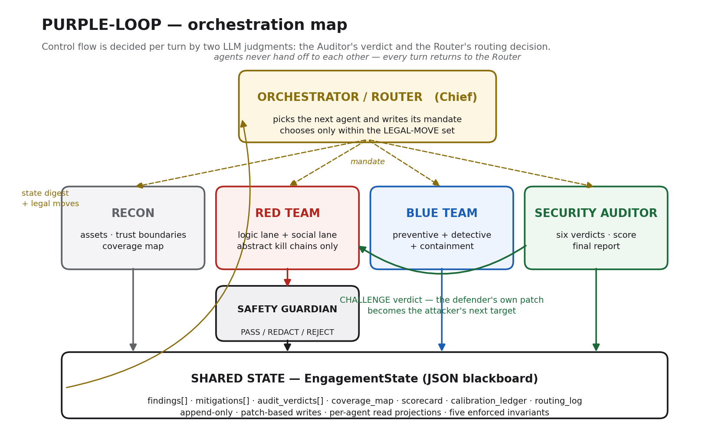

# PURPLE-LOOP

**A dynamic multi-agent orchestration architecture for adversarial security evaluation — Red Team vs Blue Team vs Auditor.**


-brightgreen)


PURPLE-LOOP replaces a static, checklist-style security review with a structured debate between LLM agents. An attacker, a defender and an independent auditor work over a shared state object, while a **Router agent** decides at every turn who speaks next and with what mandate. The engagement ends only when the auditor certifies convergence or the round budget runs out.

The result is not a checklist. It is a negotiated security-posture assessment with a full, replayable disagreement history.



---

## Key ideas

- **Dynamic routing, not a pipeline.** Deterministic code only *validates* moves; LLM judgments *choose* them. The self-test asserts that the executed agent sequence is not a fixed Recon → Red → Blue → Audit cycle.
- **Agents critique and audit each other.** The Auditor issues one of six verdicts (`SOUND`, `INSUFFICIENT`, `CHALLENGE`, `OVERCLAIM`, `SPECULATIVE`, `RESIDUAL_ACCEPT`) that can send control backwards, e.g. from judge to attacker.
- **Separation of powers.** The Auditor is structurally prevented from authoring findings; Red and Blue never talk directly — all communication goes through shared state.
- **Layered defense.** Every Blue Team response must cover preventive, detective and containment layers; missing layers are scored down.
- **Safety by architecture.** A dedicated Safety Guardian agent inspects every attacker output before it enters shared state, keeping reasoning at the level of vulnerability classes and MITRE ATT&CK technique IDs.

## Agents

| Agent | Role |
|---|---|
| **Router** | Meta-agent. Chooses the next agent and its mandate. Produces no security content. |
| **Recon** | Decomposes the target into assets, trust boundaries and an initial coverage map. |
| **Red Team** | Produces abstract attack hypotheses in two lanes: software/logic and human process. |
| **Blue Team** | Produces layered countermeasures for each finding. |
| **Auditor** | Independent judge. Issues verdicts, computes the 0–100 security score and writes the final report. |
| **Safety Guardian** | Cross-cutting filter on every attacker output: pass, redact or reject. |

## Quick start

Requires **Python 3.10+**. The default (mock) mode needs no API key, no network and no third-party packages.

```bash
git clone https://github.com/Atlass000/purple-loop.git
cd purple-loop/implementation

# Verify the ten architectural invariants (expected: 10/10 checks passed)
python purple_loop.py --self-test

# Run a full engagement against the fictional sample target
python purple_loop.py --target sample_target.md

# Regenerate the importable agent package from the prompt file
python purple_loop.py --build-package
```

### Live mode (optional)

Drive the same orchestration with real Claude agents:

```bash
pip install -r requirements.txt
export ANTHROPIC_API_KEY=your_key_here      # Windows: set ANTHROPIC_API_KEY=your_key_here
python purple_loop.py --target sample_target.md --live
```

If the key is not set, the script falls back to mock mode automatically.

## Repository structure

```
implementation/
  purple_loop.py            orchestrator: mock mode, live API mode, self-test, package build
  01_ARCHITECTURE.md        full design document
  02_AGENT_PROMPTS.md       system prompts for all six agents (single source of truth)
  03_STATE_SCHEMA.json      JSON Schema for the shared engagement state
  04_SCORING_RUBRIC.md      the Auditor's scoring rubric
  sample_target.md          fictional example target ("NovaPay")
  sample_run_report.md      output of the bundled 12-round run
  final_state.json          complete end-of-engagement state (replayable)
  architecture.png          orchestration map
  myskillos_package/        importable agent team (CLAUDE.md + .claude/agents/*.md)
  docs/                     extended architecture report (PDF)

myskillos_export/           the agent team as exported from the Myskillos platform
report/                     course submission form (PDF + LaTeX source)
```

## Where to look first

1. `python purple_loop.py --self-test` — check 10 proves control flow is dynamic.
2. `implementation/sample_run_report.md` §2 *Routing history* — legal moves vs. the move actually chosen, per round.
3. `implementation/sample_run_report.md` §4 *Disagreement history* — every verdict with its rationale, including `CHALLENGE` loops.
4. `implementation/01_ARCHITECTURE.md` — the full design, including state management, feedback loops and routing.

## Tech stack

Python 3 (standard library only) · Anthropic Claude API (optional live mode) · JSON Schema · Myskillos / Claude sub-agent layout

## Safety note

This is a **tabletop exercise** over a fictional, text-described architecture. No operational attack content, exploit code or real targets are involved. No secret keys or personal data are included in this repository.

## Context

Built as the individual term project for **SENG 456 — Agent Orchestration and Multimodal Systems**, Software Engineering, OSTIM Technical University (2026 Summer School).
Myskillos project: https://www.myskillos.com/project/490fe3ca-64b6-4831-b7e5-17a67adf7724

## Author

**Mohammed Mustafa Kareem** — Software Engineering, OSTIM Technical University

## License

Released under the [MIT License](LICENSE).
